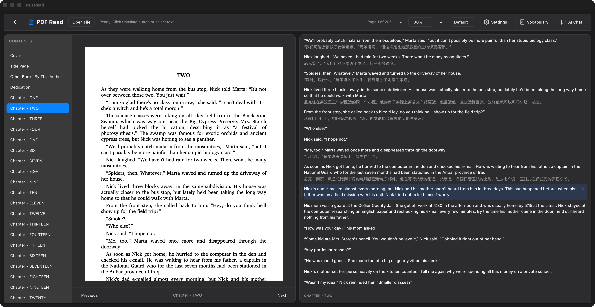

# PDFRead

A Tauri desktop PDF bilingual reader with sentence-level alignment and translation.

<p align="center">
  
</p>

## Why PDFRead

Reading technical PDFs in another language is slow. PDFRead keeps the original PDF on the left and sentence-level translations on the right, so you can scan and compare without losing your place.

## Highlights

- Two-column layout: PDF on the left, translations and controls on the right.
- Sentence-level translation with aligned highlights on the PDF.
- Read-only Slate rendering for clean, consistent text.
- Virtualized translation list for long documents.
- Local JSON cache for translations (no repeated costs).

## How It Works

- PDF rendering: pdf.js (`pdfjs-dist/legacy/build/pdf.mjs`) with text layer overlays.
- Sentence extraction: single-column heuristic in `src/lib/textExtraction.ts`.
- Translation pipeline: frontend -> Tauri command -> OpenRouter -> cache.
- Cache keys: docId + sid + source text hash + model + target language.

## Install (Homebrew)

```bash
brew update && brew tap everettjf/tap && brew install --cask reporead
```

## Develop

```bash
bun install
bun run tauri dev
```

## Build

```bash
bun run build
```

## Usage

1. Open a PDF.
2. Select target language and model.
3. Hover or click a sentence to highlight corresponding regions in the PDF.
4. Translations are cached locally for fast repeat access.

## Settings

- Theme: system / light / dark
- Translation mode:
  - Window: current page ± radius
  - Chunk: translate by page blocks
- Debounce: 400ms; concurrency: 1; stale responses ignored

## Project Structure

- `src/components/PdfViewer.tsx`: PDF list and navigation
- `src/components/PdfPage.tsx`: PDF page rendering and highlights
- `src/components/TranslationPane.tsx`: Translation UI (Slate read-only)
- `src/lib/textExtraction.ts`: Sentence extraction
- `src-tauri/src/lib.rs`: OpenRouter translation command

## Recommended IDE Setup

- VS Code + Tauri extension + rust-analyzer

## Star History

[](https://star-history.com/#everettjf/PDFRead&Date)
